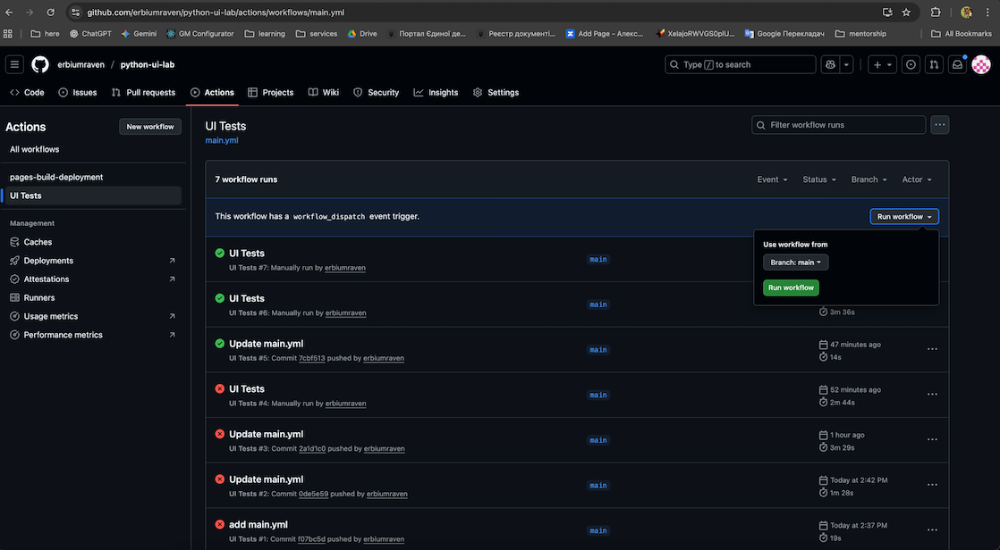
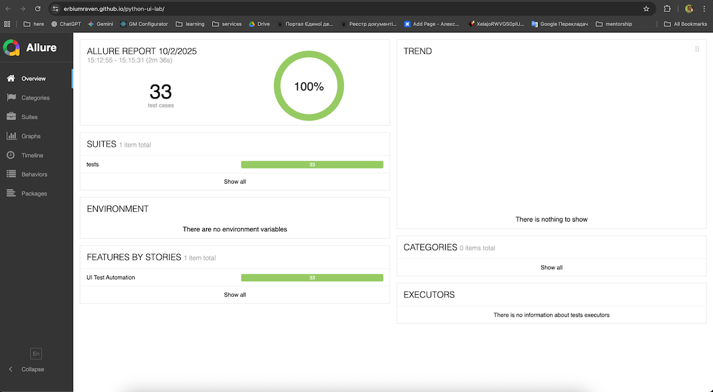

# python-ui-lab

A learning repository for practicing UI test automation with Python.

- **Java 21+** – required only for generating Allure reports
- **Allure CLI** – required only for generating Allure reports
- **Docker** – required for running tests inside Docker

**Note:** It is recommended to run tests in Docker, as it ensures a consistent environment, avoids dependency conflicts,
and allows running tests both locally and on remote hosts without manual setup.

## Running Tests

### 1. Run tests locally in docker
Run the following commands in root folder:
```bash
docker build -t playwright-tests . # build docker image

docker run --rm \                    
  -v $(pwd)/allure-results:/app/allure-results \
  playwright-tests
```

This following command will create an `allure-results` folder with test data. To generate a human-readable report, run:
```bash
allure generate allure-results --clean -o allure-report
```

Then open `./allure-report/index.html` file in the browser.

### 2. Run test on CI
Open [GitHub Actions](https://github.com/erbiumraven/python-ui-lab/actions) and start UI Tests workflow.



Once the pipeline completes, view the [report](https://erbiumraven.github.io/python-ui-lab/) on GitHub Pages.

